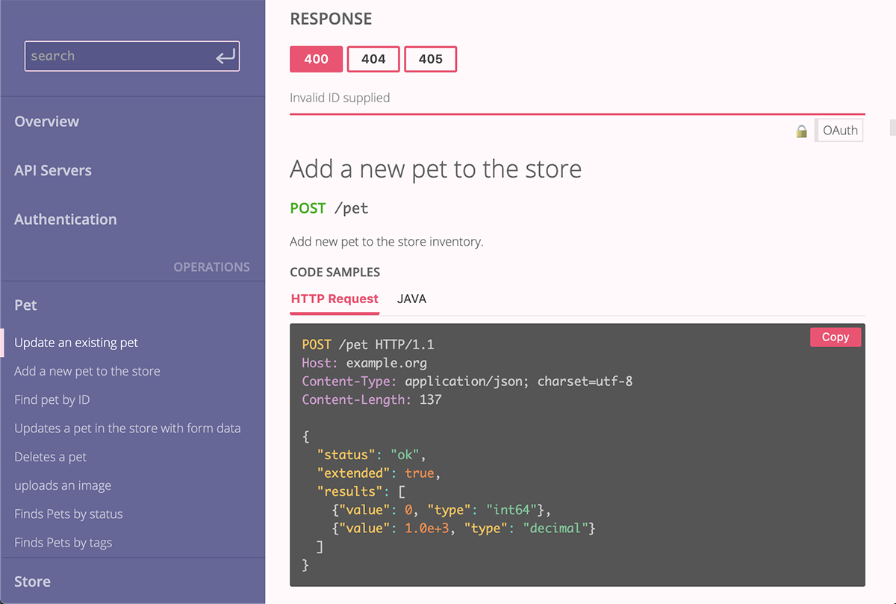

# Rapidoc for Quart
[](https://github.com/marirs/quart-rapidoc)
[](https://github.com/marirs/quart-rapidoc/blob/master/LICENSE)

Create beautiful, customizable, 
interactive API documentation from OpenAPI Specification for Quart.


[RapiDoc](https://mrin9.github.io/RapiDoc/) is fully customisable and small and fast.
It comes with built in console to Try out the APIs. 
Supports authentication mechanism. 

### Quickstart

First, install ``Quart-Rapidoc``

```bash
pip install Quart-Rapidoc
```

Next, add Rapidoc class to your code:
```python
    from quart import Quart
    from quart_rapidoc import Rapidoc

    app = Quart(__name__)
    app.config['DOC_FILE'] = 'petstore.yml'
    Rapidoc(app)
```

You can also customise the docs rendering:
```python
    from quart import Quart
    from quart_rapidoc import Rapidoc

    app = Quart(__name__)
    conf = {
        "allow-try": False,
        "theme": "light",
        "show-header": True,
    }

    app.config['RAPIDOC_CONFIG'] = conf            
    Rapidoc(app)
```
More of config parameters can be found [here](https://mrin9.github.io/RapiDoc/api.html#att-general)

### Compatibility

``Quart-Rapidoc`` depends on recent versions of Quart, PyYaml. 
``Quart-Rapidoc`` may work with older versions, but compatibility fixes for older versions will not be accepted, and 
future changes may break compatibility in older versions.

Quart-Rapidoc is tested against ``Python 3.7+`` versions.

#### More Info
Rapidoc: <https://mrin9.github.io/RapiDoc/>

#### Screenshots

  
  
  
  
  
  
  
  
  
  
  
  
---
Contributors of Quart-Rapidoc

Sriram G <https://github.com/marirs>
